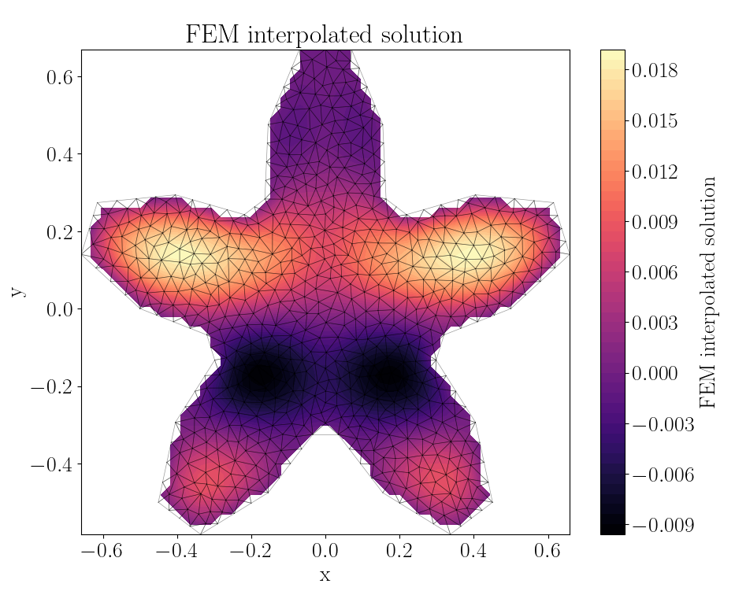
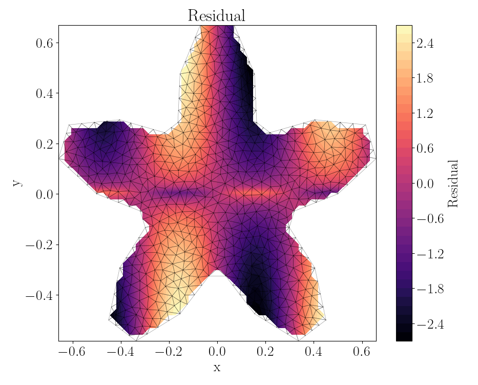
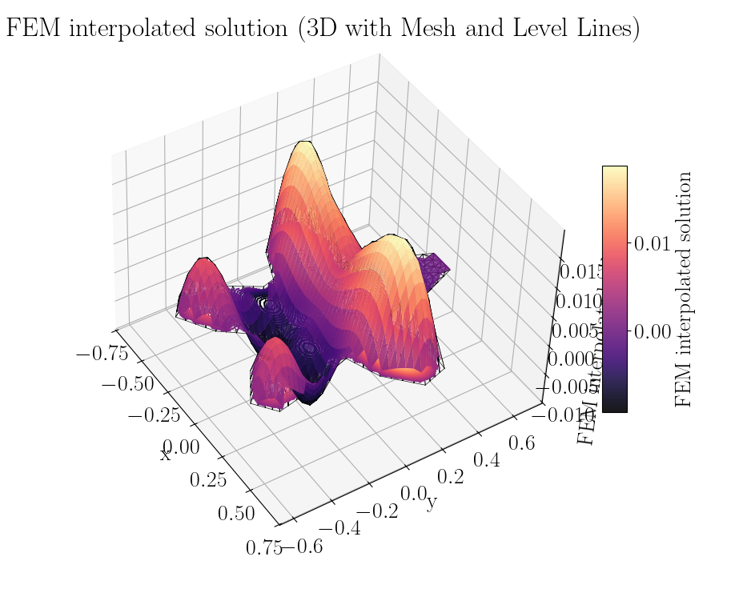

# fem_portfolio

A small finite-element method (FEM) portfolio with a 2D solver and CLI.

## Requirements

- Python 3.8+

## Install

From the repo root:

```bash
python3 -m venv .venv
source .venv/bin/activate
pip install -e .
```

## Run the CLI (module)

From the repo root:

```bash
python3 -m src.cli --pde poisson --domain square
```

## Example run

Command:

```bash
python3 -m src.cli --pde poisson --f "sin(10*x)*np.log(30*np.abs(y)+0.2)" --domain star --max_triangle_area 0.001
```

Sample output:

```
Mapping points of a 50x50 grid to their corresponding triangle...
100%|███████████████████████████████████████████████████████████████| 50/50 [00:14<00:00,  3.37it/s]
2026-02-11 16:17:27,683 - INFO - Assembling linear system, looping over the 1270 elements...
100%|███████████████████████████████████████████████████████████| 1270/1270 [01:01<00:00, 20.50it/s]
Enter a command ('q' to quit, 'mesh' to plot mesh, 'solution contour', etc.):
(i) In order to plot something, input one word from each of the groups.
        Group 1:
                - "solution".
                - "residual".
                - "source".
        Group 2:
                - "scatter", only accepted after "solution".
                - "3d".
                - "contour".
        ----------------------
        Example inputs:
                - "solution scatter"
                - "residual contour"
                - "source 3d"
                - "solution 3d"
        ----------------------

        You can also plot the mesh by typing "mesh".

(ii) You can compute and print one of the following quantities:
        - "residual norm".
        - "source norm" for the L2-norm of the source term $||f(x, y)||_{L_2}$.
Use "q" to quit.
Write your input here:
```

Screenshots:





## Notes

- `analyses/` contains example scripts.
- `archive/` contains older experiments.
